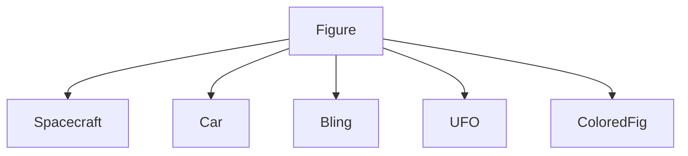
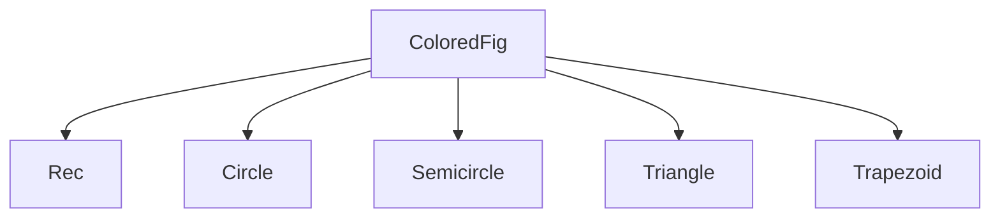

# VG101 Project 3

------

**Contributors:**  

​	Jin Zhejian 金哲健  517370910167

​	Chen Yaxin 陈雅昕 517021911020

​	Liu Yuelin 刘越麟  517370910252

​	Zheng Jingnan 郑静楠 517370910103


# **CONTNETS**

[TOC]

------

# Part 1: A Generic Parking Lot

## 1. Introduction

​	Write a simulation where random vehicles enter and exit the parking lot over a given period of time.


## 2. **Descriptions about the code**

> The directory "Arrival" is to store the arrival tickets.

> The directory "Departure" is to store the departure tickets.

> Each vehicle generated is given a unique number to name txt file of the ticket.

> The class Vehicle and Parkinglot are defined in d.h header file.

> Each Vehicle has arrival time, price(different for different type of vehicle), time it will spend in the parkinglot, the car number and the time it will leave as its attributes.

> Class car, van, motorbike and bicycle inherit the class vehicle.

> Each Parkinglot has vacant and a vehicle as attribute.

> checkin function is to checkin one vehicle into a empty slot in the parkinglot;

> randomcheckin function use the checkin function and randomly checkin several cars into the parkinglot each time it is called.

> checkout function is to checkout all the car needing to checkout at that time in the parkinglot.

> In the main function, the whole parkinglot is store in a vector.

> Variable t is used to determine the lasting time of the simulation.

> Array nowtime is used to store the current time.

> Variable totalnumberofcar is used to give each car a specific number.


# Part 2: An interstellar parking lot

## 1. Introduction

​	This part is to use OpenGL to draw an interstellar parking lot and drive a car into a random lot. It it written in C++.We implement a image with ten slots. Whether the slot is empty and which kind of vehicle is parked in it is randomly generated.

There are three kinds of vehicles that might appear:

1. A teleported vehicle which randomly changes color.
2.  A UFO which spins on itself. 
3. A spacecraft which continuously zooms in and out.

		There is at least one slot free, and once the user runs the program, the parking slot is randomly generated and the door open , the car drives into an empty slot with smooth trajectory.


## 2. Instructions

The project contains:

```cmakelist
CMakelist.txt (Clion needed), main.cpp, vector.h, vector.cpp, colorfig.h, colorfig.cpp, group.h, group.cpp, random.h,  Readme.txt.
```

The information added in the cmakelist to run the program is:

```cmakelist
add_executable(project3 main.cpp vector.h vector.cpp colorfig.h colorfig.cpp group.h, group.cpp, random.h)
```

Therefore, the writer only need to run the main function, it will randomly generate a parking lot and you can see the car enter a empty slot.

**Reminder**:  Check working directory, run main.


## 3. Descriptions about the problem

1.  Use OpenGL to draw a parking lot with ten empty slots.

2.  Randomly choose which of the slot to park vehicles and the kind of vehicles in random.h.

3.  Defining the operator of vectors in vector.h  vector.cpp .

4.  Define basic figures and the operation functions with them in colorfig.h  colorfig.cpp.

5.  Define figures of the four kinds of vehicles and operation functions with them in group.h group.cpp

6.  Draw the trajectory of the anchor of car for ten cases in main.cpp

   

## 4. Descriptions about the algorithm


### 1) The inheritance table:




### 2) Random function:

​	For the initialization of all the transportations, we use a function called  "random", in which we successively random which place the car should stop, if each place there already exists a car, and if that which transportation should be placed. Thus, all the transportation has been initialized and we get the position for the car to stop.


### 3)  The move of the car:

​	Then, to begin with, the car will firstly stop for while to wait the door open, then the car start to move. The way to let it move according to the expected path is to divide the map into different parts and then use the conditional function. When the car need to rotate, it will choose a reasonable point as the rotation axis and use the function of move to move around this axis, and at the same time it will rotates accordingly.

The part2 and part3 are implemented in the random1() function:

```c++
void random() {
    srand(time(NULL));
    int static carPool=rand() % 10;
    Vec v0;
    //  int static carPool =
//    double static width = 10, height = 20, owidth= 10;
//    float static A = 50;
    int static c[10] = {rand() % 3, rand() % 3, rand() % 3, rand() % 3, rand() % 3, rand() % 3, rand() % 3, rand() % 3, rand() % 3, rand() % 3};
    int static b[10] = {rand() % 2, rand() % 2, rand() % 2, rand() % 2, rand() % 2, rand() % 2, rand() % 2, rand() % 2, rand() % 2, rand() % 2};
    for (int i = 0; i < 10; i++) {
        if (i != carPool) {
            if (b[i] == 1) {
                switch (c[i]) {
                    case 0: //Bling
                        v0 = randomPool(i);
                        drawBling(v0);
                        break;

                    case 1: //spaceship
                        v0 = randomPool(i);
                        drawSpace(v0);
                        break;

                    case 2: //UFO
                        v0 = randomPool(i);
                        drawUFO(v0);
                        break;
                }
            }
        }
    }
    int static a =carPool;
    int static flag = 0;
    int static flag1=0;
    Vec dis = randomPool(a);
    const float angle = 2;
    Vec static vec = Vec(0, 0);
    Car static car({-100,-85});
    if (flag1==0){
        car.CarR(90);
        flag1=1;
    }
    static vector<Vec> points;
    points.push_back(car.getAnchor());
    vector<Vec>:: iterator it;
    for (it=points.begin();it!=points.end();it++){
        glPointSize(3);

        glColor3f((float)rand()/RAND_MAX/2+0.5,(float)rand()/RAND_MAX/2+0.5,(float)rand()/RAND_MAX/2+0.5);
        glBegin(GL_POINTS);
        glVertex3f((*it).getX(),(*it).getY(),0.0);
        glEnd();
    }
    car.CarD();


    if (car.getAnchor().getX() == -100 && car.getAnchor().getY() <= -50) {
        vec = Vec(0, 1);
    } else if (car.getAnchor().getX() <= -74 && flag == 0) {
        vec = (Vec(car.getAnchor().getX() + 75.0, car.getAnchor().getY() + 50) >> angle) -
              Vec(car.getAnchor().getX() + 75.0, car.getAnchor().getY() + 50);
        car.CarR(-angle * v);
    } else if (a < 5) {
        if (car.getAnchor().getX() < dis.getX() + 20 && flag == 0) {
            vec = Vec(1, 0);
        } else if (car.getAnchor().getX() - 0.01 >= dis.getX()) {
            flag = 1;
            float static y = car.getAnchor().getY();
            vec = (Vec(car.getAnchor().getX() - dis.getX() - 20, car.getAnchor().getY() - y + 20) << angle) -
                  Vec(car.getAnchor().getX() - dis.getX() - 20, car.getAnchor().getY() - y + 20);
            car.CarR(angle * v);
        } else if (car.getAnchor().getY() >= -65) {
            vec = Vec(0, -1);
        } else { vec = {0, 0}; }
    } else {
        if (car.getAnchor().getX() <= 65 && flag == 0) {
            vec = {1, 0};
        } else {
            if (car.getAnchor().getX() >= 65) {
                flag = 1;
                vec = (Vec(car.getAnchor().getX() - 65.0, car.getAnchor().getY()) << angle) -
                      Vec(car.getAnchor().getX() - 65.0, car.getAnchor().getY());
                car.CarR(angle * v);
            } else {
                if (car.getAnchor().getX() > dis.getX() - 20 && flag == 1) {
                    vec = Vec(-1, 0);
                } else if (car.getAnchor().getX() +0.001 <= dis.getX()) {
                    flag = 2;
                    float static y = car.getAnchor().getY();
                    vec = (Vec(car.getAnchor().getX() - dis.getX() + 20, car.getAnchor().getY() - y - 20) << angle) -
                          Vec(car.getAnchor().getX() - dis.getX() + 20, car.getAnchor().getY() - y - 20);
                    car.CarR(angle * v);
                } else if (car.getAnchor().getY() <= 65) {
                    vec = Vec(0, 1);
                } else { vec = {0, 0}; }
            }
        }
    }
    int static ii=0;
    ii+=2;
    if (ii>90)
    car.CarM(vec);

}
```


### 4) OpenGL Implementation:

```c++
void TimeStep(int n)
{
    glutTimerFunc(25, TimeStep, 0);
    glutPostRedisplay();
}

void drawScene()
{
    //black
    glColor3f(0.0f, 0.0f, 0.0f);
    glLineWidth(4);
    glBegin(GL_LINES);
    glVertex2f(-120.0f, 80.0f);glVertex2f(120.0f, 80.0f);glVertex2f(-75.0f, -80.0f);glVertex2f(120.0f, -80.0f);
    glVertex2f(-120.0f, -80.0f);glVertex2f(-120.0f, 80.0f);glVertex2f(120.0f, -80.0f);glVertex2f(120.0f, 80.0f);
    glLineWidth(3);
    //up
    glVertex2f(-15.0f, 50.0f);glVertex2f(-15.0f, 80.0f);glVertex2f(15.0f, 50.0f);glVertex2f(15.0f, 80.0f);
    glVertex2f(-45.0f, 50.0f);glVertex2f(-45.0f, 80.0f);glVertex2f(45.0f, 50.0f);glVertex2f(45.0f, 80.0f);
    glVertex2f(-75.0f, 50.0f);glVertex2f(-75.0f, 80.0f);glVertex2f(75.0f, 50.0f);glVertex2f(75.0f, 80.0f);
    //down
    glVertex2f(-15.0f, -50.0f);glVertex2f(-15.0f, -80.0f);glVertex2f(15.0f, -50.0f);glVertex2f(15.0f, -80.0f);
    glVertex2f(-45.0f, -50.0f);glVertex2f(-45.0f, -80.0f);glVertex2f(45.0f, -50.0f);glVertex2f(45.0f, -80.0f);
    glVertex2f(-75.0f, -50.0f);glVertex2f(-75.0f, -80.0f);glVertex2f(75.0f, -50.0f);glVertex2f(75.0f, -80.0f);
    glEnd();

    glColor3f(0.5f, 0.5f, 0.5f);
    glBegin(GL_QUADS);
    glVertex2f(-65.0f, 7.0f);glVertex2f(-65.0f, -7.0f);glVertex2f(65.0f, -7.0f);glVertex2f(65.0f, 7.0f);
    glEnd();
}

void ChangeSize(int w, int h)
{
    if(h == 0) h = 1;

    glViewport(0, 0, w, h);

    glMatrixMode(GL_PROJECTION);
    glLoadIdentity();

    if (w <= h)
        glOrtho (-100.0f, 100.0f, -100.0f*h/w, 100.0f*h/w, -100.0f, 100.0f);
    else
        glOrtho (-100.0f*w/h, 100.0f*w/h, -100.0f, 100.0f, -100.0f, 100.0f);

    glMatrixMode(GL_MODELVIEW);
    glLoadIdentity();
}

void glDraw()
{
    glClear(GL_COLOR_BUFFER_BIT | GL_DEPTH_BUFFER_BIT); 
    door();
    drawScene();
    random1();
    glutSwapBuffers();
    glFlush();
}

int main(int argc, char* argv[]) {
    glutInit(&argc, argv);
    glutInitDisplayMode(GLUT_RGB|GLUT_DOUBLE); 
    glutInitWindowSize(2000,1500);   
    glutInitWindowPosition(300,150);  
    glutCreateWindow("parking lot");
    glClearColor(1.0, 1.0, 1.0, 0.0);   
    glClear(GL_COLOR_BUFFER_BIT);
    glutReshapeFunc(ChangeSize);
    glutDisplayFunc(glDraw);
    glutTimerFunc(25,TimeStep,0); 
    glutMainLoop();
}
```


## 6. Some known bugs and limitations:

​	The curve is not smooth enough.


# Bonus:

## 1. The car moving game 

	### 1) Input and out put:

**Input:**   6 keys in total:

* press "**UP**" to move up.

* press "DOWN" to move down.

* press "**LEFT**" to move left.

* press "**RIGHT**" to move right.

* press "**PageUp**" to rotate counterclockwise.

* press "**PageDown**" to move clockwise.

* press "ESC" to exit the whole project.

  

**Out put:**  the car at the left top corner at initial time will move accordingly according to the input of the user.


### 2) Implementation: 

Use glutKeyboardFunc(processNormalKeys); 

​	& glutSpecialFunc(processSpecialKeys);

to recive the keys, and the car2 draw is added in the glDraw function.

They are:

```c++
void processNormalKeys(unsigned char key, int x, int y)
{

    if (key == 27)  //按ESC退出
        exit(0);
}

void processSpecialKeys(int key, int x, int y)
{
    float static A2 = 10;
    Vec static dir2 = {1, 1};
    switch (key) {
        //up
        case GLUT_KEY_UP:
            dir2 = {0, 2};
            car2.CarM(dir2);
            cout << "up" << endl;
            break;
            //left
        case GLUT_KEY_LEFT:
            dir2 = {-2,0};
            car2.CarM(dir2);
            break;
            //right
        case GLUT_KEY_RIGHT:
            dir2 = {2,0};
            car2.CarM(dir2);
            break;
            // down
        case GLUT_KEY_DOWN:
            dir2 = {0,-1};
            car2.CarM(dir2);
            break;

        case GLUT_KEY_PAGE_UP:
            car2.CarR(A2);
            break;
        case GLUT_KEY_PAGE_DOWN:
            car2.CarR(-A2);
            break;
        default:
            break;
    }
}
```


## 2. Rainbow track

​	The track of the first car has a rainbow track when its moving.

We use vector to store each point the car has moved. The implementation is in the random1() function:

```C++
static vector<Vec> points;
points.push_back(car.getAnchor());
vector<Vec>:: iterator it;
for (it=points.begin();it!=points.end();it++){
    glPointSize(3);

    glColor3f((float)rand()/RAND_MAX/2+0.5,(float)rand()/RAND_MAX/2+0.5,(float)rand()/RAND_MAX/2+0.5);
    glBegin(GL_POINTS);
    glVertex3f((*it).getX(),(*it).getY(),0.0);
    glEnd();
}
```


# Some words:

​	Many thanks to our beloved teacher Manuel and TAs !!!

